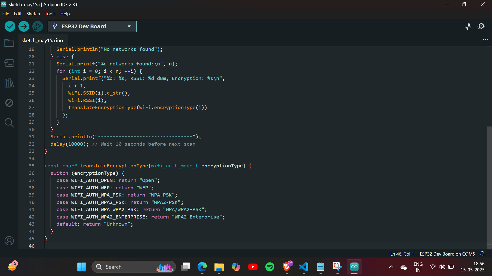
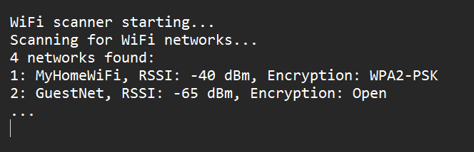

# ESP32 Wi-Fi Scanner

This project scans nearby Wi-Fi networks using the ESP32 and displays SSID, RSSI, and encryption type.

#Setup
- Installed Arduino IDE
- Added ESP32 board support
- Selected ESP32 Dev Module

## 🛠 Code Summary
- Used `WiFi.scanNetworks()` to detect networks
- Displayed signal strength and encryption type

## 🧪 Troubleshooting
- Upload errors fixed by pressing BOOT button
- Added `WiFi.mode(WIFI_STA)` to ensure proper scan

## ✅ Output

## 📸 Screenshots

### 1. Arduino IDE Code View

### 2. Simulated Serial Monitor Output

> These are mock screenshots added for documentation, as hardware was not available during testing.
